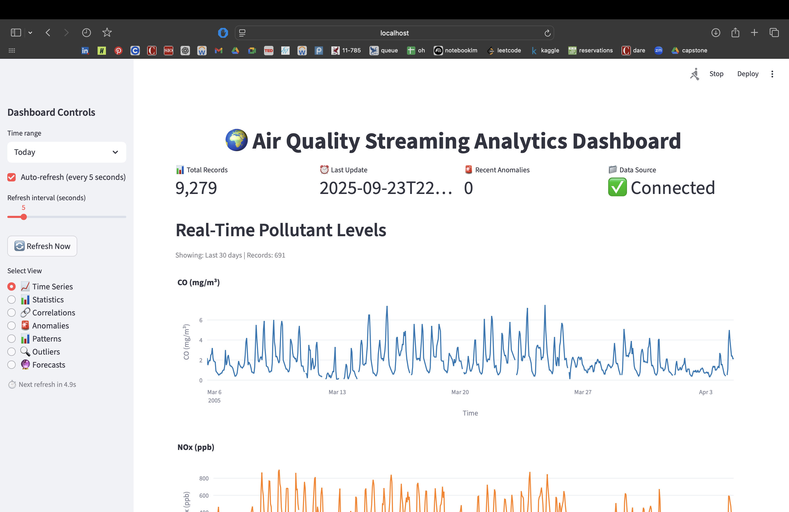
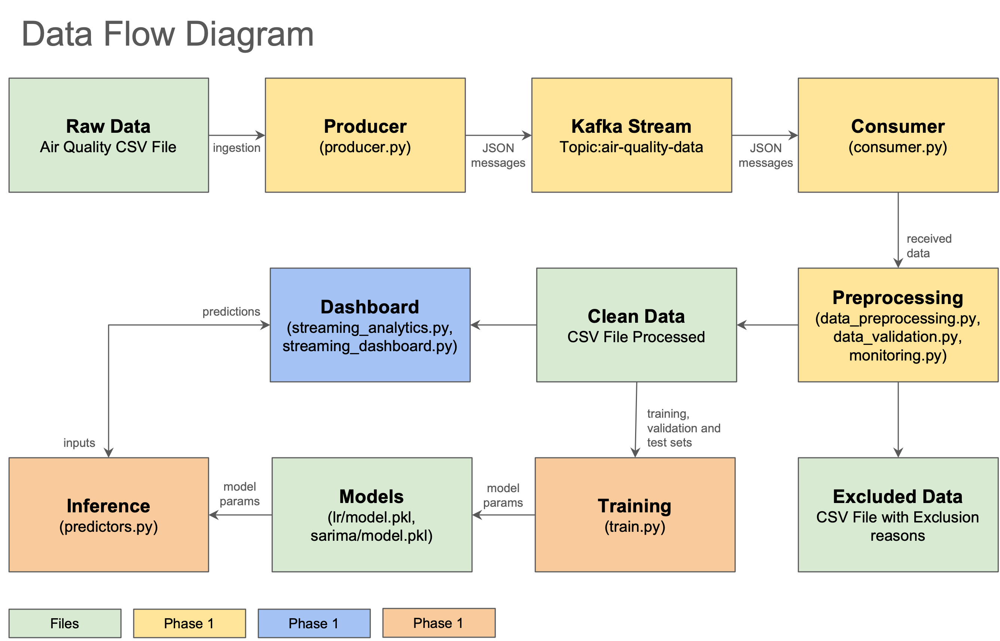

# Real-Time Air Quality Prediction with Apache Kafka

A comprehensive streaming analytics platform for real-time air quality monitoring and forecasting, demonstrating the integration of Apache Kafka with machine learning for environmental applications.

## Project Overview

This project implements an end-to-end data pipeline using the UCI Air Quality dataset to demonstrate proficiency in streaming architecture, exploratory data analysis, and predictive modeling deployment. The system processes environmental sensor data in real-time, conducts advanced pattern analysis, and deploys predictive models for proactive air quality management.

### Key Features

- **Real-Time Streaming**: Apache Kafka-based data pipeline with producer-consumer architecture
- **Advanced Analytics**: Comprehensive exploratory data analysis with temporal pattern identification
- **Predictive Modeling**: Linear Regression and SARIMA models for 6-hour air quality forecasting
- **Interactive Dashboard**: Streamlit-based real-time analytics and visualization interface
- **Production Integration**: Seamless model deployment with monitoring and logging capabilities

### Air Quality Parameters Monitored

- **Carbon Monoxide (CO)**: Measured in mg/m³
- **Nitrogen Oxides (NOx)**: Measured in ppb
- **Nitrogen Dioxide (NO2)**: Measured in µg/m³
- **Benzene**: Measured in µg/m³



## Project Structure

```
individual-programming-assignment/
├── phase_1_streaming_infrastructure/     # Kafka setup and data pipeline
├── phase_2_data_intelligence/           # Analytics dashboard and EDA
├── phase_3_predictive_analytics/        # ML models and forecasting
├── documentation/                        # Phase-specific documentation
│   ├── phase_1_setup_and_troubleshooting.md
│   ├── phase_1_preprocessing_methodology.md
│   ├── phase_2_set_up_documentation.md
│   ├── phase_2_analysis.md
│   └── phase_3_decisions_setup.md
├── final_report/                        # Final comprehensive report
│   └── final_report.md
└── README.md                            # This file
```

## Prerequisites

- **Python**: Version 3.8 or newer
- **Apache Kafka**: Version 3.0.0 or newer
- **System Requirements**: Minimum 8GB RAM, 4 CPU cores, 10GB available storage
- **Dependencies**: kafka-python, pandas, numpy, scikit-learn, matplotlib, statsmodels, streamlit, plotly

## Environment Setup

### Create and Activate Conda Environment

```bash
# 1. Create a new conda environment
conda create -n kafka-air-quality python=3.9

# 2. Activate the environment
conda activate kafka-air-quality

# 3. Install core dependencies
pip install -r requirements.txt

# 4. Verify installation
python -c "import kafka, pandas, numpy, sklearn, streamlit, plotly, statsmodels; print('All dependencies installed successfully!')"
```

## Quick Start Guide

### Phase 1: Streaming Infrastructure Setup

**Objective**: Set up Apache Kafka streaming infrastructure for real-time data ingestion and processing.

**Quick Start**:
```bash
# 1. Install and start Kafka (KRaft mode)
brew install kafka
brew services start kafka

# 2. Navigate to Phase 1 directory
cd phase_1_streaming_infrastructure

# 3. Install dependencies
pip install -r requirements.txt

# 4. Start the producer (generates streaming data)
python producer.py

# 5. In another terminal, start the consumer (processes data)
python consumer.py
```

**What You'll See**:
- Real-time data streaming from UCI Air Quality dataset
- Data preprocessing and quality validation
- Clean data output to `data/processed/air_quality_clean.csv`

**Key Files**:
- `producer.py`: Kafka producer for data ingestion
- `consumer.py`: Kafka consumer for data processing
- `data_preprocessing.py`: Data quality management
- `config/kafka_config.py`: Kafka configuration settings

### Phase 2: Data Intelligence Dashboard

**Objective**: Build interactive analytics dashboard for exploratory data analysis and pattern identification.

**Quick Start**:
```bash
# 1. Navigate to Phase 2 directory
cd phase_2_data_intelligence

# 2. Install dependencies
pip install streamlit plotly pandas numpy

# 3. Start the analytics dashboard
streamlit run streaming_dashboard.py
```

**What You'll See**:
- Interactive dashboard with multiple tabs:
  - **Time Series**: Real-time pollutant concentration plots
  - **Statistics**: Comprehensive statistical summaries
  - **Correlations**: Cross-pollutant correlation analysis
  - **Anomalies**: Outlier detection and characterization
  - **Forecasts**: Real-time predictions (requires Phase 3 models)

**Key Features**:
- Real-time data visualization
- Temporal pattern analysis (daily, weekly, seasonal)
- Statistical analysis and correlation matrices
- Anomaly detection with z-score analysis
- Interactive filtering and range selection

### Phase 3: Predictive Analytics

**Objective**: Develop and deploy machine learning models for air quality forecasting.

**Quick Start**:
```bash
# 1. Navigate to Phase 3 directory
cd phase_3_predictive_analytics

# 2. Install ML dependencies
pip install scikit-learn statsmodels joblib scipy

# 3. Train all models (unified approach)
python train.py

# 4. Or train models individually:
python training/train_linear_regression.py
python training/train_sarima.py
```

**What You'll Get**:
- **Linear Regression Model**: 68% MAE improvement over baseline
- **SARIMA Model**: 8.7% MAE improvement with uncertainty quantification
- **Model Artifacts**: Saved models, scalers, and performance metrics
- **Statistical Validation**: Paired t-tests confirming significance

**Model Performance**:
- **Linear Regression**: MAE = 102 ppb, RMSE = 139 ppb, R² = 0.417
- **SARIMA**: MAE = 126 ppb, RMSE = 158 ppb, R² = 0.238
- **Forecast Horizon**: 6-hour ahead predictions
- **Integration**: Automatic loading in Phase 2 dashboard

### Phase 4: Documentation and Reporting

**Objective**: Comprehensive documentation and final report synthesis.

**Available Documentation**:
- **Setup Guides**: Detailed installation and troubleshooting instructions (`documentation/`)
- **Analysis Reports**: Comprehensive data intelligence findings (`documentation/`)
- **Technical Documentation**: Architecture decisions and implementation details (`documentation/`)
- **Final Report**: Complete project synthesis and business insights (`final_report/`)

**Final Report Location**:
```bash
# The comprehensive final report is located at:
final_report/final_report.md
```

## Key Findings

### Environmental Patterns
- **Traffic Dominance**: Vehicular emissions are primary pollution source
- **Seasonal Variation**: 5.4x concentration difference between summer minimum and winter peak
- **Daily Patterns**: Pronounced bimodal peaks during morning and evening rush hours
- **Weekend Effect**: 30% reduction in nitrogen oxide concentrations on weekends

### Model Performance
- **Linear Regression**: Superior performance with comprehensive feature engineering
- **Statistical Significance**: Both models significantly outperform naive baseline
- **Production Ready**: Real-time inference with comprehensive logging and monitoring

### Business Intelligence
- **Peak Risk Periods**: Morning (8-9 AM) and evening (7-8 PM) rush hours
- **High-Risk Seasons**: November-February require enhanced monitoring
- **Operational Thresholds**: Z-score based alerting with pollutant-specific limits

## Technical Architecture



### Streaming Pipeline
- **Kafka Producer**: Simulates real-time sensor data with configurable speedup
- **Kafka Consumer**: Processes data with micro-batching and quality validation
- **Data Storage**: CSV-based persistence with append-only design

### Analytics Engine
- **Streamlit Dashboard**: Interactive visualization and analysis interface
- **Real-Time Processing**: Sliding window analytics and correlation analysis
- **Anomaly Detection**: Z-score based outlier identification

### Predictive Models
- **Feature Engineering**: Lag features, rolling statistics, temporal encodings
- **Model Selection**: Linear Regression (primary) and SARIMA (secondary)
- **Production Integration**: Automatic model loading and real-time inference

## Dependencies

### Core Requirements
```
kafka-python>=2.0.0
pandas>=1.3.0
numpy>=1.21.0
scikit-learn>=1.0.0
streamlit>=1.0.0
plotly>=5.0.0
```

### Optional Extensions
```
statsmodels>=0.13.0
matplotlib>=3.5.0
seaborn>=0.11.0
```

## Troubleshooting

### Common Issues

**Kafka Connection Problems**:
- Ensure Kafka broker is running on localhost:9092
- Check Zookeeper is started before Kafka broker
- Verify firewall settings allow Kafka communication

**Data Processing Errors**:
- Check data file exists: `phase_1_streaming_infrastructure/data/AirQualityUCI.csv`
- Verify Python dependencies are installed correctly
- Review log files for specific error messages

**Model Training Failures**:
- Ensure Phase 1 has generated clean data
- Check sufficient data points for training (>1000 records)
- Verify all required dependencies are installed

**Dashboard Issues**:
- Ensure Streamlit is installed: `pip install streamlit`
- Check port 8501 is available for dashboard
- Verify data files are accessible from dashboard directory

## Contributing

This project was developed as part of the "Fundamentals of Operationalizing AI" course. The implementation demonstrates best practices in:

- Streaming data architecture design
- Real-time analytics and visualization
- Machine learning model development and deployment
- Production-ready system integration
- Comprehensive documentation and reporting

## License

This project is developed for educational purposes as part of an academic assignment.

## Acknowledgments

This project was developed with assistance from Claude AI to ensure technical accuracy, comprehensive analysis, and professional presentation. The implementation reflects the integration of streaming technologies with predictive analytics for environmental applications.

## MLflow Tracking (Phase 3)

- Training scripts now log to MLflow under `phase_3_predictive_analytics/mlruns` using experiment name `AirQuality-NOx-6h`.
- To view runs locally:

```bash
cd phase_3_predictive_analytics
mlflow ui --backend-store-uri file://$PWD/mlruns --host 127.0.0.1 --port 5000
```

- Each run records:
  - Parameters: algorithm/config, feature count, horizon
  - Metrics: validation and test metrics (MAE, RMSE, R², sMAPE), significance tests
  - Artifacts: model binaries, features.json, metrics.json (under per-model subfolders)

### Auto-register best model (optional)
- Requires MLflow server with DB backend (registry not supported on file:// stores)
- Enable auto-registration during training:

```bash
export MLFLOW_TRACKING_URI=http://127.0.0.1:5000
export REGISTER_BEST=1
cd phase_3_predictive_analytics
python train.py
```

- Behavior: selects the best run in experiment `AirQuality-NOx-6h` by lowest `test_rmse`, registers it as `AirQualityNOx6h`, and promotes to Production (archiving previous versions).

### Recommended local setup with env vars

1) Start MLflow server with registry (SQLite) in Phase 3 dir:
```bash
cd phase_3_predictive_analytics
mlflow server --backend-store-uri sqlite:///mlflow.db \
  --default-artifact-root file://$PWD/mlruns_artifacts \
  --host 127.0.0.1 --port 5000
```

2) Export env vars (current shell):
```bash
export MLFLOW_TRACKING_URI=http://127.0.0.1:5000
export REGISTER_BEST=1
export MODEL_NAME=AirQualityNOx6h
```

3) Train and auto-register:
```bash
cd phase_3_predictive_analytics
python train.py
```

4) View UI: http://127.0.0.1:5000

### Using a .env file (optional)

Create `phase_3_predictive_analytics/.env`:
```bash
MLFLOW_TRACKING_URI=http://127.0.0.1:5000
REGISTER_BEST=1
MODEL_NAME=AirQualityNOx6h
```

Load and run:
```bash
cd phase_3_predictive_analytics
set -a; source .env; set +a
python train.py
```

---

**Author**: Santiago Bolaños Vega  
**Course**: Fundamentals of Operationalizing AI 
**Date**: September 23, 2025
