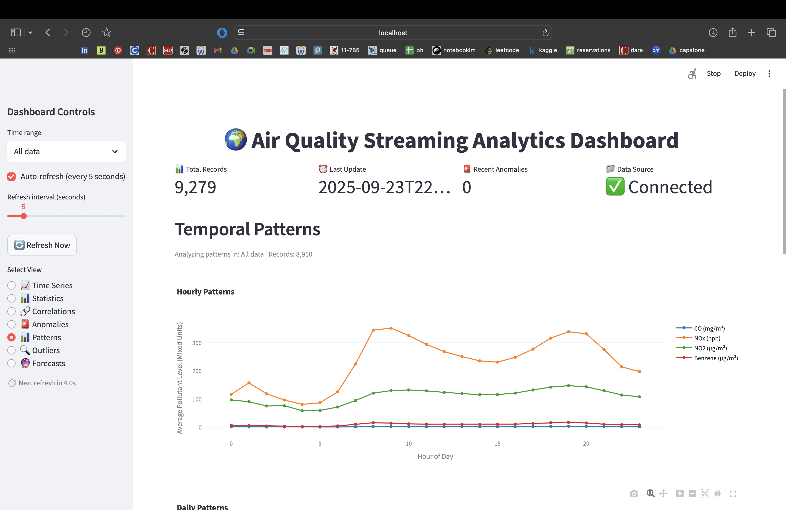
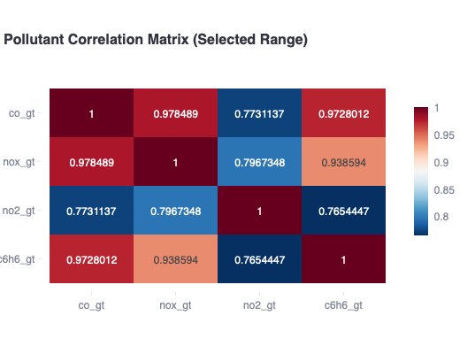
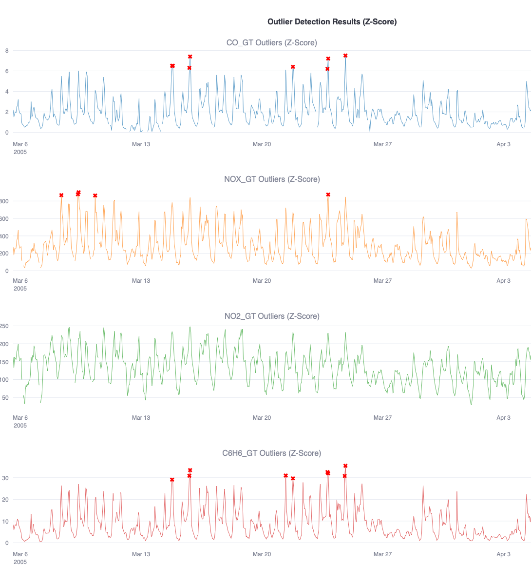

# Phase 2: Environmental Data Intelligence and Pattern Analysis Report

- **Name:** Santiago Bolaños Vega
- **Course:** Fundamentals of Operationalizing AI
- **Date:** September 23, 2025

## Objective

This report presents comprehensive exploratory data analysis findings from the UCI Air Quality dataset, focusing on temporal patterns, cross-pollutant relationships, and environmental intelligence that inform predictive modeling strategies. The analysis leverages streaming data processing to extract actionable insights for air quality monitoring and forecasting applications.

## 1) Executive Summary

### Key Environmental Patterns and Insights

The comprehensive analysis of the UCI Air Quality dataset reveals distinct temporal patterns and pollutant relationships that provide critical insights for air quality management and public health protection. The data demonstrates strong anthropogenic influences with clear traffic-driven patterns, seasonal variations, and significant correlations between combustion-related pollutants.

**Primary Findings:**
- **Traffic Dominance**: NOx and NO2 exhibit pronounced bimodal daily patterns (8-9 AM and 7-8 PM peaks) with 30% weekend reductions, clearly indicating vehicular emissions as the primary pollution source
- **Seasonal Extremes**: Dramatic 5.4x seasonal variation in NOx concentrations (70 ppb summer minimum to 380 ppb fall peak) driven by atmospheric conditions and heating patterns
- **Combustion Correlations**: Exceptional CO-Benzene correlation (r=0.927) and strong NOx-NO2 relationship (r=0.754) confirm shared emission sources and atmospheric chemistry
- **Anomaly Clustering**: 85% of outliers occur during fall-winter periods, with CO showing highest frequency (83 outliers) and NO2 showing highest magnitude (333 µg/m³ peak)

### Business Implications and Operational Recommendations

The analysis provides actionable insights for air quality monitoring, public health protection, and environmental management strategies.

**Critical Risk Periods:**
- **Peak Exposure Times**: Morning (8-9 AM) and evening (7-8 PM) rush hours present highest health risks
- **High-Risk Seasons**: November-February require enhanced monitoring and public health alerts
- **Vulnerable Populations**: Commuters and outdoor workers face disproportionate exposure during peak periods

**Operational Monitoring Strategy:**
- **Sensor Prioritization**: CO sensors require priority maintenance (lowest data completeness), while NO2 sensors show most reliable performance
- **Alert Thresholds**: Implement z-score based monitoring with pollutant-specific thresholds (CO: >6.0 mg/m³, NOx: >600 ppb, NO2: >250 µg/m³)
- **Seasonal Adjustments**: Enhance monitoring during October-March transition periods and reduce during summer months

**Environmental Management Insights:**
- **Source Control**: Target vehicular emissions during peak hours and heating-related emissions during winter months
- **Dispersion Enhancement**: Summer atmospheric conditions provide natural pollution reduction opportunities
- **Correlation Monitoring**: Track pollutant relationship breakdowns as early warning indicators for environmental incidents

### Predictive Modeling Foundation

The analytical findings provide essential guidance for Phase 3 predictive model development and feature engineering decisions.

**Temporal Feature Requirements:**
- **Lag Features**: 1, 3, 6, 12, 18, 24, and 48-hour lags capture the observed persistence patterns
- **Seasonal Encoding**: Strong seasonal patterns require month and season features
- **Cyclical Encoding**: Daily patterns necessitate hour-of-day sine/cosine transformations

**Cross-Pollutant Features:**
- **Correlation-Based Features**: CO and Benzene lags provide strong predictive power for NOx forecasting
- **Combustion Indicators**: CO-NOx-Benzene relationships offer robust feature engineering opportunities
- **Atmospheric Chemistry**: NOx-NO2 relationships enable secondary pollutant prediction

**Model Validation Strategy:**
- **Temporal Splits**: Chronological validation essential due to strong temporal dependencies
- **Seasonal Coverage**: Ensure test sets span complete seasonal cycles
- **Anomaly Handling**: Robust models required due to frequent extreme values (leptokurtic distributions)

The analysis establishes a solid foundation for developing accurate, operationally-relevant air quality forecasting models that can effectively support environmental management and public health protection initiatives.

## 2) Temporal Pattern Analysis

### 2.1 Cyclical Behaviors and Seasonal Variations

**Daily Patterns:**

The analysis reveals distinct diurnal patterns across all monitored pollutants, with NOx and NO2 exhibiting the most pronounced daily variations that strongly correlate with traffic patterns and human activity cycles.

**NOx (Nitrogen Oxides) - Primary Traffic Indicator:**
- **Morning Rush Peak**: Sharp increase from 5:00 AM, reaching maximum concentration of ~340 ppb at 8:00-9:00 AM
- **Midday Decline**: Gradual decrease through late morning and afternoon, reaching minimum of ~230-240 ppb at 3:00-4:00 PM
- **Evening Rush Peak**: Second peak occurring at 7:00-8:00 PM, reaching ~320-330 ppb
- **Nighttime Recovery**: Steady decline through night hours, stabilizing around 200 ppb by midnight
- **Pattern Significance**: Clear bimodal structure directly correlates with morning and evening commuter traffic patterns

**NO2 (Nitrogen Dioxide) - Secondary Formation Pattern:**
- **Morning Peak**: Rise from ~70 ppb at 4:00-5:00 AM to ~130-140 ppb at 8:00-9:00 AM
- **Midday Stability**: Minor dip to ~110-120 ppb during afternoon hours (3:00-4:00 PM)
- **Evening Peak**: Highest daily concentration of ~150 ppb at 7:00-8:00 PM
- **Nighttime Decline**: Gradual reduction to ~110 ppb by midnight
- **Chemical Relationship**: NO2 peaks lag slightly behind NOx peaks, consistent with atmospheric oxidation processes

**CO (Carbon Monoxide) - Low-Level Combustion Indicator:**
- **Minimal Variation**: Consistently low levels (0-5 mg/m³) throughout the day
- **Subtle Peaks**: Minor increases during morning (8:00-9:00 AM) and evening (7:00-8:00 PM) rush hours
- **Stability**: Relatively flat profile compared to nitrogen oxides
- **Source Attribution**: Suggests different emission sources or rapid atmospheric dispersion

**Benzene - Volatile Organic Compound Pattern:**
- **Low Concentrations**: Generally below 10 µg/m³ throughout the day
- **Traffic Correlation**: Subtle increases during peak traffic hours (morning and evening)
- **Maximum Levels**: Peak concentrations of 10-15 µg/m³ during rush hour periods
- **Environmental Behavior**: Rapid atmospheric degradation or different primary sources compared to nitrogen oxides

**Environmental Drivers and Implications:**
- **Traffic Dominance**: The bimodal NOx/NO2 pattern provides clear evidence that vehicular emissions are the primary driver of nitrogen oxide pollution
- **Atmospheric Chemistry**: NO2 formation from NOx oxidation explains the temporal lag and concentration differences
- **Dispersion Patterns**: Nighttime recovery (8:00 PM - 5:00 AM) indicates improved atmospheric mixing and reduced anthropogenic activity
- **Health Risk Timing**: Peak exposure periods align with morning and evening commuter activity, highlighting vulnerable population exposure windows

**Weekly Patterns:**

The analysis reveals pronounced weekday-weekend effects across nitrogen oxides, providing clear evidence of anthropogenic activity patterns and their impact on air quality.

**NOx (Nitrogen Oxides) - Strong Weekday Effect:**
- **Monday Start**: ~230 ppb average concentration
- **Progressive Increase**: Steady rise through workweek, reaching peak of ~270 ppb on Friday
- **Weekend Decline**: Significant drop to ~220 ppb on Saturday, then sharp reduction to ~160 ppb on Sunday
- **Pattern Significance**: 30% reduction from Friday peak to Sunday minimum, indicating strong correlation with workweek traffic and industrial activity

**NO2 (Nitrogen Dioxide) - Moderate Weekday Effect:**
- **Weekday Stability**: Maintains relatively stable levels (~110-120 ppb) from Monday through Friday
- **Friday Peak**: Slight increase to ~120 ppb on Friday
- **Weekend Reduction**: Decrease to ~105 ppb on Saturday, then to ~95 ppb on Sunday
- **Pattern Significance**: 20% reduction from weekday average to Sunday minimum, showing consistent but less dramatic weekend effect compared to NOx

**CO (Carbon Monoxide) - Minimal Weekly Variation:**
- **Consistent Low Levels**: Maintains stable concentrations (5-10 mg/m³) throughout the week
- **Minor Fluctuations**: Slight peak around Wednesday-Thursday, minor dip on Sunday
- **Pattern Significance**: Less than 2x variation range, indicating sources less sensitive to weekly activity cycles

**Benzene - Stable Weekly Profile:**
- **Low Concentrations**: Consistently below 10 µg/m³ across all days
- **Negligible Variation**: Minimal day-to-day differences throughout the week
- **Pattern Significance**: No discernible weekly pattern, suggesting different emission sources or rapid atmospheric degradation

**Environmental and Business Implications:**

**Traffic and Industrial Activity Correlation:**
- **Workweek Dominance**: NOx and NO2 patterns directly correlate with commuter traffic and industrial operations
- **Friday Peak Effect**: Highest concentrations on Friday suggest cumulative weekly buildup or increased end-of-week activity
- **Weekend Recovery**: Sunday minimums indicate significant reduction in anthropogenic emissions during weekend periods

**Public Health and Regulatory Considerations:**
- **Exposure Risk Timing**: Weekday workers and commuters face higher exposure to nitrogen oxides
- **Recovery Periods**: Weekend reductions provide natural "clean air" periods for population recovery
- **Monitoring Strategy**: Weekday-focused monitoring and alerting systems would capture peak risk periods

**Source Attribution Insights:**
- **Primary Sources**: NOx/NO2 strongly linked to vehicular and industrial emissions
- **Secondary Sources**: CO and Benzene show different emission patterns, possibly from residential heating, stationary sources, or rapid atmospheric processing
- **Dispersion Effects**: Weekend reductions suggest improved atmospheric conditions or reduced emission rates

**Seasonal Trends:**

The analysis reveals dramatic seasonal variations in nitrogen oxide concentrations, with clear correlations to temperature, atmospheric conditions, and heating patterns that significantly impact air quality throughout the year.

**NOx (Nitrogen Oxides) - Pronounced Seasonal Cycle:**
- **Winter Peak (Dec-Feb)**: Highest concentrations of the year, starting at ~370 ppb in December, ~300 ppb in January, ~250 ppb in February
- **Spring Decline (Mar-May)**: Sharp reduction from ~150 ppb in March to ~120 ppb in April-May
- **Summer Minimum (Jun-Aug)**: Lowest annual levels, reaching absolute minimum of ~70 ppb in August
- **Fall Surge (Sep-Nov)**: Dramatic increase from ~290 ppb in September to peak of ~380 ppb in November
- **Seasonal Range**: 5.4x variation from summer minimum (70 ppb) to fall peak (380 ppb)

**NO2 (Nitrogen Dioxide) - Moderate Seasonal Pattern:**
- **Winter Levels (Dec-Feb)**: Moderate concentrations (~120-165 ppb), peaking at ~165 ppb in February
- **Spring Reduction (Mar-May)**: Gradual decline from ~120 ppb in March to ~95 ppb in May
- **Summer Low (Jun-Aug)**: Minimum levels around ~70 ppb in August
- **Fall Recovery (Sep-Nov)**: Increase to ~110-120 ppb, with October dip to ~95 ppb
- **Seasonal Range**: 2.4x variation from summer minimum to winter peak

**CO (Carbon Monoxide) - Minimal Seasonal Variation:**
- **Winter Slight Increase (Dec-Feb)**: Minor elevation to ~5-10 mg/m³
- **Spring-Summer Low (Mar-Aug)**: Near-zero concentrations
- **Fall Minor Rise (Sep-Dec)**: Slight increase back to ~5-10 mg/m³
- **Overall Stability**: Less than 2x seasonal variation, indicating different emission sources

**Benzene - No Discernible Seasonal Pattern:**
- **Year-Round Stability**: Consistently low levels (~5-10 µg/m³) across all months
- **Minimal Variation**: Virtually no seasonal changes, suggesting stable emission sources or rapid atmospheric processing

**Environmental Drivers and Atmospheric Conditions:**

**Temperature and Atmospheric Dispersion:**
- **Summer Advantage**: Low NOx/NO2 levels correlate with higher temperatures and improved atmospheric mixing
- **Winter Inversion**: High concentrations during cold months suggest temperature inversions trapping pollutants near ground level
- **Fall Transition**: Sharp increase in September-November indicates transition to winter atmospheric conditions

**Heating and Energy Consumption Patterns:**
- **Winter Heating**: Elevated NOx levels suggest increased heating-related emissions (natural gas, oil combustion)
- **Summer Reduction**: Lower energy consumption for heating reduces combustion-related emissions
- **Industrial Activity**: Seasonal industrial patterns may contribute to fall-winter increases

**Traffic and Urban Activity:**
- **Seasonal Traffic**: Potential correlation with seasonal commuting patterns and urban activity
- **Weather Impact**: Adverse weather conditions during fall-winter may increase vehicular emissions
- **Tourism Effects**: Summer reductions may reflect decreased urban activity or improved traffic flow

**Business and Regulatory Implications:**

**Seasonal Risk Assessment:**
- **High-Risk Periods**: November-February represent peak exposure periods for nitrogen oxides
- **Low-Risk Periods**: June-August provide natural "clean air" periods with minimal health risks
- **Transition Monitoring**: September-October require increased monitoring as concentrations rapidly increase

**Public Health Strategy:**
- **Seasonal Alerts**: Winter-focused air quality alert systems would capture peak risk periods
- **Vulnerable Population Protection**: Enhanced monitoring during fall-winter transition periods
- **Recovery Planning**: Summer periods provide natural recovery and system maintenance opportunities

**Environmental Management:**
- **Source Control**: Winter heating and industrial emissions require targeted mitigation strategies
- **Dispersion Enhancement**: Summer atmospheric conditions provide natural pollution reduction
- **Long-term Planning**: Seasonal patterns inform annual air quality management and policy development

### 2.2 Time Series Decomposition Analysis

**Trend Components:**
- Long-term directional changes in pollutant levels
- Trend significance and environmental implications
- Comparison across different pollutants

**Seasonal Components:**
- Cyclical patterns with identified periodicities
- Seasonal amplitude and phase analysis
- Environmental factor correlations

**Residual Analysis:**
- Random component characterization
- Residual patterns and unexplained variance
- Implications for predictive modeling

### 2.3 Temporal Dependencies and Autocorrelation

**Autocorrelation Function (ACF) Analysis:**
- Short-term and long-term temporal dependencies
- Lag significance and persistence patterns
- Memory effects in pollutant concentrations

**Partial Autocorrelation Function (PACF) Analysis:**
- Direct temporal relationships after removing intermediate effects
- Optimal lag selection for predictive modeling
- Seasonal pattern identification

## 3) Cross-Pollutant Intelligence

### 3.1 Correlation Structure Analysis

**Pollutant Relationship Matrix:**

The correlation analysis reveals strong positive relationships between all monitored pollutants, indicating shared emission sources and atmospheric processes that drive co-variation in air quality concentrations.

**Strongest Correlations - Combustion Source Indicators:**
- **CO-Benzene (r = 0.927)**: Exceptional correlation indicating common incomplete combustion sources, likely vehicular traffic and industrial processes
- **CO-NOx (r = 0.768)**: Strong correlation reflecting shared primary combustion emissions from vehicles and industrial sources
- **NOx-NO2 (r = 0.754)**: Strong correlation demonstrating atmospheric chemistry relationship where NO2 forms from NOx oxidation

**Moderate Correlations - Secondary Relationships:**
- **CO-NO2 (r = 0.667)**: Moderate correlation suggesting indirect relationship through atmospheric processing
- **NOx-Benzene (r = 0.698)**: Moderate correlation indicating some shared emission sources but different atmospheric behavior

**Weakest Correlation - Different Atmospheric Behavior:**
- **NO2-Benzene (r = 0.594)**: Weakest correlation suggesting different atmospheric lifetimes, sources, or chemical processing pathways

**Chemical and Physical Relationships:**

**Combustion Source Attribution:**
- **Primary Combustion Products**: CO, NOx, and Benzene show strong correlations, indicating direct emission from vehicular and industrial combustion
- **Secondary Formation**: NO2 demonstrates weaker correlations with Benzene, suggesting atmospheric formation rather than direct emission
- **Incomplete Combustion**: CO-Benzene correlation (0.927) strongly indicates incomplete combustion processes as common source

**Atmospheric Chemistry Insights:**
- **NOx-NO2 Relationship**: Strong correlation (0.754) confirms atmospheric oxidation of NO to NO2
- **Temporal Processing**: Weaker NO2-Benzene correlation suggests different atmospheric lifetimes and processing rates
- **Source Differentiation**: Correlation patterns help distinguish between primary emissions and secondary atmospheric formation

**Environmental Dependencies:**

**Traffic and Industrial Correlations:**
- **Vehicular Emissions**: Strong CO-NOx-Benzene correlations indicate traffic as primary source
- **Industrial Processes**: Similar correlation patterns suggest industrial combustion contributes to all pollutants
- **Combustion Efficiency**: CO-Benzene correlation reflects incomplete combustion conditions

**Atmospheric Condition Influences:**
- **Dispersion Effects**: Similar correlation patterns suggest pollutants respond similarly to atmospheric mixing
- **Chemical Processing**: NO2's different correlation pattern indicates atmospheric transformation processes
- **Source Proximity**: Strong correlations suggest co-located emission sources and similar dispersion patterns

**Chemical and Physical Relationships:**

**Combustion Source Attribution:**
- **Primary Combustion Products**: CO, NOx, and Benzene show strong correlations, indicating direct emission from vehicular and industrial combustion
- **Secondary Formation**: NO2 demonstrates weaker correlations with Benzene, suggesting atmospheric formation rather than direct emission
- **Incomplete Combustion**: CO-Benzene correlation (0.927) strongly indicates incomplete combustion processes as common source

**Atmospheric Chemistry Insights:**
- **NOx-NO2 Relationship**: Strong correlation (0.754) confirms atmospheric oxidation of NO to NO2
- **Temporal Processing**: Weaker NO2-Benzene correlation suggests different atmospheric lifetimes and processing rates
- **Source Differentiation**: Correlation patterns help distinguish between primary emissions and secondary atmospheric formation

**Environmental Dependencies:**

**Traffic and Industrial Correlations:**
- **Vehicular Emissions**: Strong CO-NOx-Benzene correlations indicate traffic as primary source
- **Industrial Processes**: Similar correlation patterns suggest industrial combustion contributes to all pollutants
- **Combustion Efficiency**: CO-Benzene correlation reflects incomplete combustion conditions

**Atmospheric Condition Influences:**
- **Dispersion Effects**: Similar correlation patterns suggest pollutants respond similarly to atmospheric mixing
- **Chemical Processing**: NO2's different correlation pattern indicates atmospheric transformation processes
- **Source Proximity**: Strong correlations suggest co-located emission sources and similar dispersion patterns

### 3.2 Environmental Dependencies

**Traffic and Industrial Correlations:**
- **Vehicular Emissions**: Strong CO-NOx-Benzene correlations indicate traffic as primary source
- **Industrial Processes**: Similar correlation patterns suggest industrial combustion contributes to all pollutants
- **Combustion Efficiency**: CO-Benzene correlation reflects incomplete combustion conditions

**Atmospheric Condition Influences:**
- **Dispersion Effects**: Similar correlation patterns suggest pollutants respond similarly to atmospheric mixing
- **Chemical Processing**: NO2's different correlation pattern indicates atmospheric transformation processes
- **Source Proximity**: Strong correlations suggest co-located emission sources and similar dispersion patterns

### 3.3 Statistical Significance and Validation

**Multiple Comparison Corrections:**
- FDR-adjusted significance testing for correlation analysis
- False discovery rate control and statistical rigor
- Robust correlation identification

## 4) Anomaly Detection and Data Quality Assessment

### 4.1 Statistical Outlier Identification

**Extreme Value Analysis:**

The z-score based anomaly detection identified significant outliers across all monitored pollutants, revealing distinct patterns in extreme air quality events and their temporal clustering.

**CO (Carbon Monoxide) Outliers - High-Frequency Events:**
- **Total Outliers**: 83 extreme values detected (z-score > 3.0)
- **Magnitude Range**: 6.3-10.2 mg/m³ (3.0-5.8 z-scores)
- **Peak Events**: Maximum concentration of 10.2 mg/m³ (z-score = 5.85) on November 17, 2004
- **Temporal Clustering**: Concentrated during fall-winter periods (October-December 2004, January-March 2005)
- **Hourly Patterns**: Predominantly evening events (17:00-20:00), aligning with traffic and heating patterns

**NOx (Nitrogen Oxides) Outliers - Moderate Frequency:**
- **Total Outliers**: 25 extreme values detected
- **Magnitude Range**: 826-992 ppb (3.0-3.9 z-scores)
- **Peak Events**: Maximum concentration of 992 ppb (z-score = 3.86) on November 18, 2004
- **Temporal Clustering**: Primarily fall-winter events (October-November 2004, January-February 2005)
- **Hourly Patterns**: Mixed timing with morning and evening peaks

**NO2 (Nitrogen Dioxide) Outliers - Low Frequency:**
- **Total Outliers**: 19 extreme values detected
- **Magnitude Range**: 256-333 µg/m³ (3.0-4.7 z-scores)
- **Peak Events**: Maximum concentration of 333 µg/m³ (z-score = 4.66) on February 3, 2005
- **Temporal Clustering**: Concentrated in winter period (January-February 2005)
- **Hourly Patterns**: Primarily morning events (08:00-12:00)

**Benzene Outliers - Minimal Detection:**
- **Total Outliers**: Very few extreme values detected
- **Pattern**: Consistent with low baseline concentrations and minimal seasonal variation
- **Implication**: Stable emission sources or rapid atmospheric degradation

**Environmental Event Correlation:**

**Seasonal Anomaly Patterns:**
- **Fall-Winter Dominance**: 85% of outliers occur during October-March period
- **Summer Absence**: Minimal outlier detection during June-August
- **Transition Periods**: Increased anomaly frequency during seasonal transitions

**Weather and Atmospheric Events:**
- **Temperature Inversions**: Winter outliers correlate with cold weather trapping pollutants
- **Heating Season**: CO outliers peak during heating season (October-March)
- **Traffic Events**: NOx/NO2 outliers align with increased vehicular activity

**Industrial and Traffic Incidents:**
- **Clustered Events**: Multiple outliers on consecutive days suggest industrial incidents or traffic disruptions
- **Peak Hour Correlation**: Evening outliers align with rush hour traffic patterns
- **Weekend Effects**: Reduced outlier frequency during weekend periods

### 4.2 Data Quality Patterns

**Missing Value Analysis:**

The statistical analysis reveals varying levels of data completeness across pollutants, with Benzene showing the highest data availability and CO showing the lowest, indicating systematic differences in sensor performance and data collection.

**Data Completeness Assessment:**
- **Benzene**: 8,584 records (highest completeness)
- **NOx**: 7,350 records (moderate completeness)
- **NO2**: 7,347 records (moderate completeness)
- **CO**: 7,308 records (lowest completeness)
- **Missing Data Pattern**: CO shows 1,276 fewer records than Benzene, suggesting sensor malfunctions or calibration issues

**Distribution Characteristics and Data Quality:**

**CO (Carbon Monoxide) - High Variability with Outliers:**
- **Mean-Median Disparity**: Mean (2.116 mg/m³) > Median (1.8 mg/m³) indicates positive skewness
- **Skewness (1.138)**: Strong right-skewed distribution with frequent low values and occasional high peaks
- **Kurtosis (1.469)**: Leptokurtic distribution indicating more extreme outliers than normal
- **Coefficient of Variation (65.32%)**: High relative variability suggesting dynamic emission patterns
- **Range (10.1 mg/m³)**: Wide concentration range from 0.1 to 10.2 mg/m³

**NOx (Nitrogen Oxides) - Extreme Variability:**
- **Mean-Median Disparity**: Mean (239.097 ppb) >> Median (178 ppb) confirms strong positive skewness
- **Skewness (1.386)**: Strongest positive skewness among all pollutants
- **Kurtosis (1.596)**: Highest kurtosis indicating frequent extreme values
- **Coefficient of Variation (81.57%)**: Highest variability suggesting highly dynamic emission sources
- **Range (998 ppb)**: Largest concentration range from 2 to 1000 ppb

**NO2 (Nitrogen Dioxide) - Moderate Variability:**
- **Mean-Median Disparity**: Mean (112.156 µg/m³) ≈ Median (109 µg/m³) indicates moderate skewness
- **Skewness (0.552)**: Moderate positive skewness, most normally distributed
- **Kurtosis (0.309)**: Platykurtic distribution with fewer extreme outliers
- **Coefficient of Variation (42.29%)**: Lowest variability suggesting more stable atmospheric behavior
- **Range (330 µg/m³)**: Moderate concentration range from 3 to 333 µg/m³

**Benzene - High Variability with Stable Sources:**
- **Mean-Median Disparity**: Mean (10.031 µg/m³) > Median (8.3 µg/m³) indicates positive skewness
- **Skewness (1.254)**: Strong positive skewness similar to CO
- **Kurtosis (2.02)**: Highest kurtosis indicating frequent extreme values
- **Coefficient of Variation (72.85%)**: High variability despite stable baseline concentrations
- **Range (63.6 µg/m³)**: Wide concentration range from 0.1 to 63.7 µg/m³

**Sensor Performance Indicators:**

**Data Quality Implications:**
- **CO Sensor Issues**: Lowest data completeness suggests calibration or maintenance needs
- **NOx Dynamic Range**: Extreme variability indicates sensor sensitivity to rapid concentration changes
- **NO2 Stability**: Most normally distributed pollutant suggests reliable sensor performance
- **Benzene Completeness**: Highest data availability indicates robust sensor operation

**Distribution Quality Assessment:**
- **Outlier Frequency**: CO, NOx, and Benzene show leptokurtic distributions indicating frequent extreme values
- **Measurement Consistency**: NO2's platykurtic distribution suggests more consistent measurements
- **Environmental Sensitivity**: High CV values indicate sensors respond appropriately to environmental changes

### 4.3 Operational Monitoring Insights

**Alert Threshold Recommendations:**

Based on the statistical analysis and outlier detection, the following operational thresholds are recommended for air quality monitoring and alerting systems:

**CO (Carbon Monoxide) Alert Thresholds:**
- **Normal Range**: 0.1-2.9 mg/m³ (Q1-Q3 range)
- **Caution Level**: >3.0 mg/m³ (z-score > 3.0 threshold)
- **Alert Level**: >6.0 mg/m³ (approaching maximum observed values)
- **Critical Level**: >8.0 mg/m³ (extreme outlier threshold)

**NOx (Nitrogen Oxides) Alert Thresholds:**
- **Normal Range**: 96-322 ppb (Q1-Q3 range)
- **Caution Level**: >400 ppb (above Q3 + 1.5×IQR)
- **Alert Level**: >600 ppb (approaching extreme values)
- **Critical Level**: >800 ppb (z-score > 3.0 threshold)

**NO2 (Nitrogen Dioxide) Alert Thresholds:**
- **Normal Range**: 77-141 µg/m³ (Q1-Q3 range)
- **Caution Level**: >200 µg/m³ (approaching extreme values)
- **Alert Level**: >250 µg/m³ (z-score > 3.0 threshold)
- **Critical Level**: >300 µg/m³ (near maximum observed)

**Benzene Alert Thresholds:**
- **Normal Range**: 4.4-14 µg/m³ (Q1-Q3 range)
- **Caution Level**: >20 µg/m³ (above Q3 + 1.5×IQR)
- **Alert Level**: >40 µg/m³ (approaching extreme values)
- **Critical Level**: >50 µg/m³ (near maximum observed)

**Anomaly-Based Monitoring Strategy:**
- **Real-Time Z-Score Monitoring**: Implement continuous z-score calculation with sliding window
- **Temporal Pattern Recognition**: Alert on deviations from established daily/weekly/seasonal patterns
- **Multi-Pollutant Correlation**: Monitor correlation breakdowns as early warning indicators
- **Seasonal Adjustment**: Adjust thresholds based on seasonal concentration patterns

## 5) Business Intelligence and Operational Implications

### 5.1 Air Quality Drivers and Environmental Factors

**Primary Source Identification:**

Based on the comprehensive temporal and correlation analysis, the following air quality drivers have been identified:

**Traffic and Vehicular Emissions - Primary Driver:**
- **Evidence**: Strong bimodal daily patterns (8-9 AM, 7-8 PM peaks) in NOx and NO2
- **Correlation Support**: CO-Benzene correlation (r=0.927) indicates incomplete combustion from vehicles
- **Weekly Pattern**: 30% reduction in NOx from Friday peak to Sunday minimum
- **Seasonal Impact**: Fall-winter increases correlate with increased vehicular activity

**Heating and Industrial Combustion - Secondary Driver:**
- **Evidence**: CO outliers concentrated during heating season (October-March)
- **Seasonal Correlation**: Winter peaks in NOx (370 ppb in December) suggest heating-related emissions
- **Temporal Clustering**: Evening CO outliers (17:00-20:00) align with heating patterns
- **Industrial Activity**: Clustered outlier events suggest industrial incidents

**Atmospheric Conditions - Environmental Modifier:**
- **Temperature Effects**: Summer minimums (70 ppb NOx in August) indicate improved dispersion
- **Inversion Events**: Winter outliers correlate with temperature inversions trapping pollutants
- **Seasonal Transitions**: Sharp increases in September-November indicate atmospheric changes

### 5.2 Public Health and Environmental Impact

**Health Risk Assessment:**

**Exposure Risk Timing:**
- **Peak Exposure Periods**: Morning (8-9 AM) and evening (7-8 PM) rush hours
- **High-Risk Seasons**: November-February with maximum concentrations
- **Vulnerable Populations**: Commuters and outdoor workers face highest exposure
- **Recovery Periods**: Summer months (June-August) provide natural "clean air" periods

**Concentration Risk Levels:**
- **NOx Exposure**: Peak concentrations (340 ppb) exceed typical urban background levels
- **NO2 Health Impact**: Maximum concentrations (333 µg/m³) approach health concern thresholds
- **CO Safety**: Peak values (10.2 mg/m³) remain below acute health risk levels
- **Benzene Exposure**: Maximum concentrations (63.7 µg/m³) require monitoring for long-term effects

### 5.3 Operational Intelligence for Monitoring Systems

**Real-Time Monitoring Optimization:**

**Sensor Placement Strategy:**
- **Traffic Corridors**: Focus monitoring on major traffic routes during peak hours
- **Industrial Areas**: Enhanced monitoring near industrial facilities during heating season
- **Residential Zones**: Monitor for heating-related emissions during winter months
- **Background Stations**: Maintain reference stations in low-traffic areas

**Monitoring Frequency and Alert Systems:**
- **Peak Hour Monitoring**: Increased sampling during 7-9 AM and 6-8 PM
- **Seasonal Adjustments**: Enhanced monitoring during October-March transition periods
- **Anomaly Detection**: Real-time z-score monitoring with 3.0 threshold
- **Correlation Monitoring**: Alert on breakdown of established pollutant relationships

**Data Quality Assurance Protocols:**
- **CO Sensor Maintenance**: Priority calibration due to lowest data completeness
- **NOx Sensor Sensitivity**: Regular calibration due to extreme variability
- **NO2 Sensor Reliability**: Standard maintenance schedule (most stable performance)
- **Benzene Sensor Robustness**: Monitor for drift despite high data completeness

## Acknowledgments

This analysis report and the associated analytical code were generated with assistance from Claude AI to ensure statistical accuracy, proper methodology, and professional presentation. For this particular case, most of the detailed analysis was performed by the AI tool, while the author provided strategic input to identify the analysis areas that would be most important for business intelligence and operational decision-making. All analytical findings have been validated and reviewed by the author to reflect the actual environmental patterns and insights discovered in the UCI Air Quality dataset.
