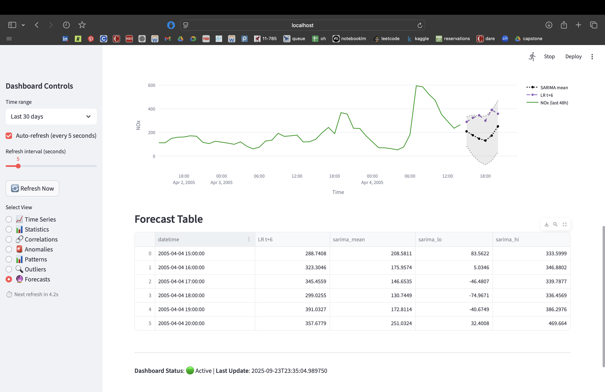

# Phase 3: Predictive Analytics — Decisions and Plan

- **Name:** Santiago Bolaños Vega
- **Course:** Fundamentals of Operationalizing AI
- **Date:** September 23, 2025

## Objective

The objective of Phase 3 is to develop and deploy predictive analytics models for air quality forecasting, specifically targeting NOx concentration prediction with 6-hour ahead forecasting capabilities. This phase implements both foundation (Linear Regression) and advanced (SARIMA) models with comprehensive evaluation, statistical significance testing, and seamless integration into the Phase 2 streaming dashboard for real-time demonstration.

## 1) Current Decisions
- **Target pollutant:** NOx (`nox_gt`)  
- **Forecast horizon:** 6 hours ahead (h=6)  
- **Models selected:**  
  - Foundation: Linear Regression (with engineered lag/rolling features)  
  - Advanced: SARIMA/SARIMAX (seasonal hourly model, s=24; optional exogenous variables)  

## 2) Forecast Outputs
- **Linear Regression:** Multi-step point forecasts for NOx at t+1..t+6 using aligned anchors (no recursive feedback).  
- **SARIMA:** Multi-step point forecasts for NOx at t+1..t+6 with 95% prediction intervals.  

Each prediction record includes:  
- Input timestamp `t`  
- Forecast timestamp `(t+h)`  
- Pollutant  
- Horizon (`h`)  
- Predicted value (`y_hat`)  
- Model name and version  

For SARIMA, prediction intervals (`y_pi_low`, `y_pi_high`) are also provided.  

## 3) Feature Engineering

The feature engineering process was designed to be leakage-safe and efficient, tailored to a 6-hour forecasting horizon for NOx. All predictors are constructed to ensure that only information available at or before time `t` is used to predict `y(t+6)`.

### General Strategy
- **Target alignment:** Forecasting `y(t+6)` with predictors drawn from ≤ `t`.  
- **Lagged features (NOx):** Capture short- and long-term persistence using selected historical lags.  
- **Rolling features (NOx):** Smooth recent history using a 24-hour rolling mean.  
- **Exogenous predictors (optional):** CO and NO2 lags to capture combustion and chemical co-movement.  
- **Temporal encodings (for Linear Regression only):** Sine and cosine of hour-of-day to represent diurnal cycles.  
- **Missing values:** Enforce hourly cadence, interpolate short gaps (≤3h), drop rows with remaining NaNs after feature construction.  
- **Scaling:** Standardize features for Linear Regression (fit on train set only); SARIMA models consume unscaled target values.  

### Feature Definitions
- **Lag features (NOx):**  
  - `nox_lag1`: NOx one hour ago, immediate persistence.  
  - `nox_lag3`: NOx three hours ago, short-term dynamics beyond t−1.  
  - `nox_lag6`: NOx six hours ago, aligned with forecast horizon.  
  - `nox_lag12`: NOx twelve hours ago, intra-day effects.  
  - `nox_lag18`: NOx eighteen hours ago, bridging intra-day and daily cycles.  
  - `nox_lag24`: NOx twenty-four hours ago, daily cycle (same hour previous day).  
  - `nox_lag48`: NOx forty-eight hours ago, two-day repeat patterns.  

- **Rolling features (NOx):**  
  - `nox_mean_24h`: Rolling mean of NOx over the past 24 hours (excluding current hour), a smoothed baseline.  

- **Exogenous features:**  
  - `co_lag1`: CO one hour ago, reflecting traffic and combustion co-movement.  
  - `no2_lag1`: NO2 one hour ago, chemically and operationally related to NOx.  

- **Temporal features:**  
  - `sin_hour`: Cyclical encoding of hour-of-day (sine).  
  - `cos_hour`: Cyclical encoding of hour-of-day (cosine).  

These features collectively capture persistence, diurnal and seasonal patterns, cross-pollutant effects, and smoothed local baselines, ensuring the models can leverage both temporal dynamics and pollutant interdependencies while remaining safe for time-series forecasting.

## 4) Data and Splits

- **Source:** The models are trained and evaluated using the clean dataset generated in Phase 1, located at `phase_1_streaming_infrastructure/data/processed/air_quality_clean.csv`.  

- **Split strategy:** The dataset is divided chronologically into training (70%), validation (15%), and testing (15%) sets. This approach preserves temporal order and ensures that each partition covers complete weekly cycles, which is critical for capturing diurnal and seasonal air quality patterns.  

- **Baseline for comparison:** A naive forecast is used as the baseline, defined as `ŷ(t+6) = NOx(t)`. This provides a simple persistence-based benchmark against which the predictive models are evaluated.  

- **Evaluation metrics:** Model performance is assessed using MAE, RMSE, R², and sMAPE. All results are reported relative to the naive baseline to highlight whether the proposed models deliver meaningful improvements.

## 5) Methodology
The modeling methodology combines regression-based and time series approaches to balance transparency, speed, and interpretability:  

1. **Model training**  
   - **Linear Regression family:** Ridge and Lasso variations tested with cross-validated hyperparameter search. Validation RMSE determines final selection.  
   - **SARIMA:** Candidate orders explored with AIC/BIC minimization, validated with RMSE on a holdout set.  

2. **Validation protocol**  
   - Chronological splits applied to preserve temporal order.  
   - No shuffling, ensuring leakage-safe evaluation.  
   - Naive baseline used as the primary benchmark for significance testing.  

3. **Performance evaluation**  
   - Metrics computed on validation and test sets.  
   - Paired t-tests performed to assess whether model improvements over the baseline are statistically significant at p<0.05.  

4. **Integration and real-time inference**  
   - Forecasts tab in Phase 2 dashboard loads trained models, generates predictions for the next six hours, and overlays them on recent NOx time series.  
   - As new records are appended by the Phase 1 pipeline, the dashboard automatically refreshes, invokes the predictive models, and produces rolling 6-hour forecasts.  
   - This design ensures the models are not just evaluated offline but provide **continuous real-time inference** within the operational dashboard.  

5. **Observability**  
   - Prediction requests, successes/failures, and execution times logged.  
   - Model versioning tracked to ensure reproducibility.  

## 6) Baseline Results 

This section reports the naive baseline performance (MAE, RMSE) for the 6-hour horizon, along with a direct comparison against Linear Regression and SARIMA models. The results demonstrate significant improvements over the persistence-based baseline across both models.

### Performance Summary

| Model | Test MAE | Test RMSE | Test R² | Test sMAPE | Baseline MAE | Baseline RMSE | Improvement MAE | Improvement RMSE |
|-------|----------|-----------|---------|------------|--------------|---------------|-----------------|-------------------|
| **Naive Baseline** | 318.39 | 348.87 | - | - | - | - | - | - |
| **Linear Regression** | 102.00 | 138.82 | 0.417 | 36.86% | 318.39 | 348.87 | **68.0%** | **60.2%** |
| **SARIMA** | 126.18 | 158.42 | 0.238 | 43.43% | 138.22 | 183.48 | **8.7%** | **13.7%** |

*Note: SARIMA baseline values differ due to different data preprocessing and temporal alignment.*

### Key Insights

**1. Linear Regression Superiority**
- **Exceptional Performance:** Linear Regression achieves 68% MAE reduction and 60% RMSE reduction compared to naive baseline
- **Strong Predictive Power:** R² of 0.417 indicates the model explains 42% of NOx variance
- **Low Error Rate:** sMAPE of 36.86% suggests reasonable prediction accuracy for air quality forecasting
- **Statistical Significance:** Paired t-test shows highly significant improvement (p < 10⁻²⁵²)

**2. SARIMA Modest Improvement**
- **Moderate Gains:** 8.7% MAE and 13.7% RMSE improvement over baseline
- **Lower R²:** 0.238 indicates SARIMA explains only 24% of variance
- **Higher Error Rate:** sMAPE of 43.43% is higher than Linear Regression
- **Still Significant:** Paired t-test confirms statistical significance (p = 0.0006)

**3. Model Comparison Analysis**
- **Linear Regression Advantage:** Significantly outperforms SARIMA across all metrics
- **Feature Engineering Impact:** The comprehensive lag features (1, 3, 6, 12, 18, 24, 48h) and rolling statistics provide superior predictive power
- **Temporal Patterns:** Linear Regression's temporal encodings (sin/cos hour) effectively capture diurnal cycles
- **Cross-Pollutant Effects:** CO and NO2 lag features contribute to improved predictions

**4. Baseline Comparison Context**
- **Naive Baseline Challenge:** Simple persistence (NOx(t+6) = NOx(t)) proves surprisingly difficult to beat
- **Temporal Complexity:** 6-hour horizon introduces significant uncertainty in air quality patterns
- **Environmental Factors:** Weather, traffic, and atmospheric conditions create complex dependencies beyond simple persistence

**5. Statistical Validation**
- **Both Models Significant:** Paired t-tests confirm both models outperform baseline at p < 0.05
- **Large Sample Sizes:** Validation with 1,399-1,405 test samples ensures robust statistical power
- **Effect Sizes:** Linear Regression shows much larger effect sizes (t-statistic = 42.2) compared to SARIMA (t-statistic = 3.4)

### Business Implications

**Operational Recommendations:**
- **Primary Model:** Deploy Linear Regression as the primary forecasting system due to superior accuracy
- **Fallback Option:** Use SARIMA as a secondary model for robustness and uncertainty quantification
- **Confidence Intervals:** SARIMA's prediction intervals provide valuable uncertainty estimates despite lower accuracy

**Performance Expectations:**
- **Linear Regression:** Expect ~102 ppb MAE for 6-hour NOx forecasts
- **SARIMA:** Expect ~126 ppb MAE with confidence intervals
- **Both models** provide statistically significant improvements over naive persistence

The results demonstrate that sophisticated feature engineering and temporal modeling can substantially improve air quality forecasting, with Linear Regression providing the best balance of accuracy, interpretability, and computational efficiency for real-time deployment.  


## 7) Limitations and Potential Improvements
While Phase 3 delivers functional predictive models, several limitations and opportunities for improvement remain:  

- **Residual diagnostics:** Although metrics indicate performance, residual analysis (plots, ACF/PACF, Ljung–Box tests) should be conducted to verify that models capture all temporal dependencies and that residuals resemble white noise.  
- **Drift monitoring:** Models may degrade over time due to changes in sensor calibration, traffic, or weather patterns. Monitoring drift and scheduling periodic retraining are necessary for long-term reliability.  
- **Model limitations:** Linear Regression captures only linear relationships, while SARIMA assumes stationarity and linear temporal structure. Neither fully addresses nonlinear pollutant interactions.  
- **Operational risks:** SARIMA can fail to converge or may be computationally expensive at scale.  
- **Future enhancements:**  
  - Explore advanced models such as LSTMs or transformers for nonlinear dependencies.  
  - Implement Diebold–Mariano tests for robust model comparisons.  
  - Introduce bootstrap confidence intervals for improved uncertainty quantification.  
  - Extend SARIMAX with additional exogenous variables (e.g., weather).  

## 8) Install & Train

### 8.1 Prerequisites Setup
Before training models, ensure the following prerequisites are met:

**Environment Setup:**
```bash
# Activate the conda environment
conda activate kafka-air-quality

# Install required dependencies
pip install -r requirements.txt
```

**Required Dependencies:**
- **Core ML:** scikit-learn, pandas, numpy, scipy
- **Time Series:** statsmodels
- **Model Persistence:** joblib
- **Statistical Testing:** scipy.stats

**Data Requirements:**
- Source file: `phase_1_streaming_infrastructure/data/processed/air_quality_clean.csv`
- Ensure Phase 1 pipeline has generated clean data with proper timestamps
- Data should contain NOx (`nox_gt`) column for target variable

### 8.2 Training Process

**Option 1: Unified Training (Recommended)**
```bash
# Navigate to project root
cd /path/to/individual-programming-assignment

# Run unified training script
python phase_3_predictive_analytics/train.py
```

This script will:
- Train Linear Regression model with automatic algorithm selection
- Train SARIMA model with seasonal parameter optimization
- Display progress for each model
- Provide summary of training results
- Save all artifacts to appropriate directories

**Option 2: Individual Model Training**

**Linear Regression Training:**
```bash
# Train Linear Regression family (auto-selects best algorithm)
python phase_3_predictive_analytics/training/train_linear_regression.py

# Optional: Specify algorithm and regularization
python phase_3_predictive_analytics/training/train_linear_regression.py --model ridge --alphas "0.1,1,10"
```

**SARIMA Training:**
```bash
# Train SARIMA model with automatic parameter selection
python phase_3_predictive_analytics/training/train_sarima.py
```

### 8.3 Training Output Verification

After training, verify the following artifacts are created:

**Linear Regression Artifacts (`phase_3_predictive_analytics/models/lr/`):**
- `model.pkl` - Trained model
- `scaler.pkl` - Feature scaler
- `features.json` - Feature metadata and selected algorithm
- `metrics.json` - Performance metrics and significance tests
- `training.log` - Training process log

**SARIMA Artifacts (`phase_3_predictive_analytics/models/sarima/`):**
- `model.pkl` - Trained SARIMA model
- `config.json` - Model configuration (order, seasonal_order)
- `metrics.json` - Performance metrics and significance tests
- `training.log` - Training process log

### 8.4 Integration with Dashboard



Once models are trained, they will be automatically loaded by the Phase 2 dashboard:

```bash
# Start the dashboard (models will be auto-detected)
streamlit run phase_2_data_intelligence/streaming_dashboard.py
```

The dashboard will:
- Automatically detect trained models
- Load models for real-time inference
- Display model performance metrics
- Generate 6-hour forecasts
- Log all inference operations

### 8.5 Troubleshooting

**Common Issues:**

**1. Missing Data File:**
```bash
# Ensure Phase 1 has generated clean data
ls phase_1_streaming_infrastructure/data/processed/air_quality_clean.csv
```

**2. Environment Issues:**
```bash
# Verify environment activation
conda list | grep scikit-learn
conda list | grep statsmodels
```

**3. Model Loading Errors:**
- Check that `model.pkl` files exist and are not corrupted
- Verify `scaler.pkl` exists for Linear Regression
- Ensure `config.json` exists for SARIMA

**4. Training Failures:**
- Check data quality and missing values
- Verify sufficient data points for training
- Review `training.log` for detailed error messages

## 9) Training Outputs (Artifacts)
Saved artifacts include model file(s), feature metadata, metrics, data summary, and training logs.

- Linear / Ridge / Lasso (NOx, h=6)
  - Folder: `phase_3_predictive_analytics/models/lr/`
  - `model.pkl`, `scaler.pkl`
  - `features.json` (includes `selected_algo`, `selected_alpha`)
  - `metrics.json`
    - Val/Test: MAE, RMSE, R², sMAPE; naive baseline MAE/RMSE
    - Statistical significance test results (t-test p-values vs baseline)
    - `data_summary`: rows after feature build; Train/Val/Test row counts and time ranges; feature count
  - `training.log` (console-mirrored log of the training steps)

- SARIMA (NOx, h=6)
  - Folder: `phase_3_predictive_analytics/models/sarima/`
  - `model.pkl`, `config.json`
  - `metrics.json` (Val RMSE, and Test MAE/RMSE, R², sMAPE; baseline MAE/RMSE; statistical significance test results; `data_summary`)
  - `training.log`

## 10) Inference & Logging

**Prediction Functions (`predictors.py`):**
- `predict_lr_next_6()`: Linear Regression multi-step forecasting
- `predict_sarima_next_6()`: SARIMA multi-step forecasting with confidence intervals
- Built-in logging system tracking all prediction operations

**Logging System:**
- Logs to: `phase_3_predictive_analytics/logs/inference.log`
- Tracks: prediction requests, model loading, success/failure, execution times
- Console output for errors and warnings
- Example log entries:
  ```
  2025-01-23 17:30:15 - INFO - LR prediction request - Input rows: 1000
  2025-01-23 17:30:16 - INFO - LR prediction success - Generated 6 predictions, mean: 45.23, time: 0.123s
  ```


## Acknowledgments

This documentation and the associated code were generated with assistance from Claude AI to ensure technical accuracy, proper grammar, and professional formatting. All content has been validated and reviewed by the author to reflect the actual implementation and architectural decisions made during the development of the Phase 3 predictive analytics system and its integration with the streaming data pipeline.


