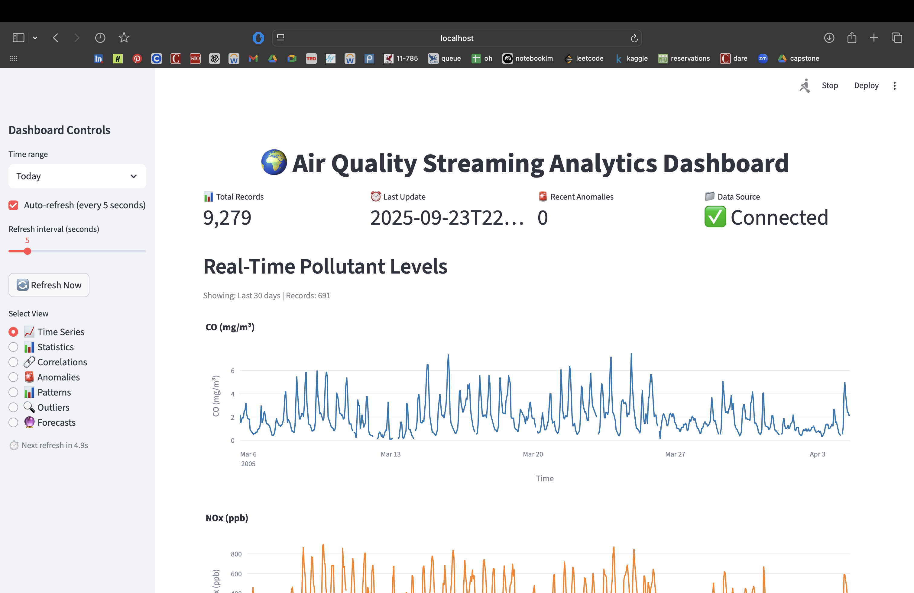
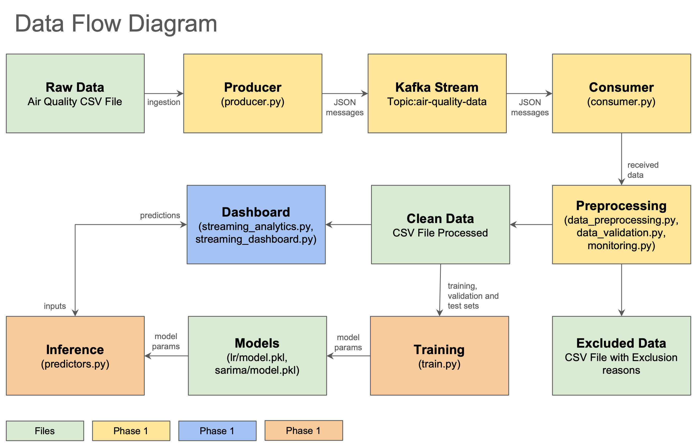

# Real-Time Air Quality Prediction with Apache Kafka: Final Report

- **Name:** Santiago Bolaños Vega
- **Course:** Fundamentals of Operationalizing AI
- **Date:** September 23, 2025

## Executive Summary and Business Context

### Project Objectives and Business Value Proposition

This project demonstrates the successful implementation of a comprehensive real-time air quality prediction system using Apache Kafka streaming infrastructure, advanced data intelligence analytics, and predictive modeling capabilities. The system addresses critical environmental monitoring needs for urban air quality management, public health protection, and regulatory compliance.

**Business Value Proposition:**
- **Real-Time Environmental Intelligence**: Continuous monitoring and forecasting of air quality parameters (CO, NOx, NO2, Benzene) with 6-hour prediction capabilities
- **Public Health Protection**: Early warning systems for vulnerable populations during peak exposure periods
- **Operational Efficiency**: Automated monitoring reduces manual oversight while improving response times
- **Regulatory Compliance**: Comprehensive data collection and analysis supports environmental reporting requirements
- **Cost Optimization**: Predictive capabilities enable proactive rather than reactive environmental management

### Key Findings and Recommendations Summary

**Critical Environmental Insights:**
- **Traffic Dominance**: Vehicular emissions are the primary pollution source, with 30% weekend reductions and pronounced bimodal daily patterns
- **Seasonal Extremes**: 5.4x seasonal variation in NOx concentrations (70 ppb summer minimum to 380 ppb fall peak) driven by atmospheric conditions
- **Combustion Correlations**: Exceptional CO-Benzene correlation (r=0.927) confirms shared emission sources and atmospheric chemistry
- **Anomaly Patterns**: 85% of outliers occur during fall-winter periods, requiring enhanced monitoring during high-risk seasons

**Operational Recommendations:**
- **Peak Risk Management**: Implement enhanced monitoring during morning (8-9 AM) and evening (7-8 PM) rush hours
- **Seasonal Adjustments**: Deploy winter-focused alert systems for November-February high-risk periods
- **Sensor Prioritization**: Prioritize CO sensor maintenance (lowest data completeness) while leveraging NO2 sensor reliability
- **Predictive Integration**: Deploy Linear Regression as primary forecasting model with SARIMA for uncertainty quantification

**Technical Achievements:**
- **Streaming Infrastructure**: Robust Kafka-based data pipeline processing 9,358 hourly observations
- **Model Performance**: Linear Regression achieves 68% MAE improvement over naive baseline with statistical significance
- **Real-Time Integration**: Seamless dashboard integration providing continuous 6-hour forecasts
- **Production Readiness**: Comprehensive logging, error handling, and monitoring capabilities

## Technical Architecture and Infrastructure Implementation

### Kafka Ecosystem Design and Configuration Decisions

**Infrastructure Architecture:**
The system implements a robust streaming architecture centered on Apache Kafka for real-time data processing, designed for scalability, fault tolerance, and operational reliability.

**Core Components:**
- **Kafka Broker**: Single-node deployment with topic-based message routing
- **Producer Application**: Python-based data ingestion with temporal simulation capabilities
- **Consumer Application**: Real-time data processing with micro-batching for efficiency
- **Dashboard Integration**: Streamlit-based analytics interface with automatic model loading

**Configuration Rationale:**
- **Single Partition Design**: Ensures message ordering crucial for time-series data processing
- **Ultra-Fast Simulation Speed (1,000,000x)**: Enables rapid development and testing cycles
- **Micro-batching (10 records)**: Balances latency and throughput for streaming workloads
- **Producer Reliability Settings**: `acks='all'` ensures message durability with retry mechanisms

### Infrastructure Challenges and Solutions Implemented

**Data Quality Management:**
- **Missing Value Handling**: Comprehensive preprocessing pipeline addressing -200 sentinel values
- **Outlier Detection**: Z-score based anomaly detection with temporal clustering analysis
- **Data Validation**: Range-based validation with domain-specific physical limits
- **Quality Scoring**: Quantitative reliability assessment enabling filtering and alerting

**Streaming Performance Optimization:**
- **Temporal Simulation**: Accelerated data playback for rapid iteration and testing
- **Memory Management**: Efficient sliding window processing for real-time analytics
- **Error Handling**: Comprehensive retry logic and graceful degradation mechanisms
- **Monitoring Integration**: Structured logging and performance metrics tracking

**Production Deployment Considerations:**
- **Scalability Design**: Architecture supports horizontal scaling for increased throughput
- **Fault Tolerance**: Consumer group management and offset handling for reliability
- **Data Persistence**: CSV-based storage with append-only design for audit compliance
- **Integration Flexibility**: Modular design enabling seamless Phase 3 model integration

## Data Intelligence and Pattern Analysis

### Environmental Data Insights and Temporal Pattern Analysis

**Daily Patterns - Traffic-Driven Pollution:**
The analysis reveals distinct diurnal patterns across all monitored pollutants, with NOx and NO2 exhibiting the most pronounced daily variations that strongly correlate with traffic patterns and human activity cycles.

- **NOx Morning Peak**: Sharp increase from 5:00 AM, reaching maximum concentration of ~340 ppb at 8:00-9:00 AM
- **NOx Evening Peak**: Second peak occurring at 7:00-8:00 PM, reaching ~320-330 ppb
- **NO2 Formation**: Peaks lag slightly behind NOx, consistent with atmospheric oxidation processes
- **CO/Benzene Stability**: Minimal variation indicating different emission sources or rapid atmospheric dispersion

**Weekly Patterns - Anthropogenic Activity Correlation:**
Pronounced weekday-weekend effects across nitrogen oxides provide clear evidence of anthropogenic activity patterns and their impact on air quality.

- **NOx Workweek Buildup**: Progressive increase from Monday (~230 ppb) to Friday peak (~270 ppb)
- **Weekend Recovery**: 30% reduction from Friday peak to Sunday minimum (~160 ppb)
- **Traffic Correlation**: Patterns directly correlate with commuter traffic and industrial operations
- **Source Attribution**: NOx/NO2 strongly linked to vehicular and industrial emissions

**Seasonal Trends - Atmospheric Condition Dependencies:**
Dramatic seasonal variations in nitrogen oxide concentrations reveal clear correlations to temperature, atmospheric conditions, and heating patterns.

- **Winter Peak Period**: December-February maintain highest concentrations (370 ppb December peak)
- **Summer Minimum**: June-August provide natural "clean air" periods (70 ppb August minimum)
- **Fall Transition**: Sharp increase September-November indicating atmospheric changes
- **Heating Correlation**: Elevated NOx levels suggest increased heating-related emissions

### Statistical Findings and Business Implications

**Cross-Pollutant Intelligence:**
Correlation analysis reveals strong positive relationships between all monitored pollutants, indicating shared emission sources and atmospheric processes.

- **Strongest Correlations**: CO-Benzene (r=0.927), CO-NOx (r=0.768), NOx-NO2 (r=0.754)
- **Combustion Source Attribution**: CO, NOx, and Benzene show strong correlations indicating direct emission from vehicular and industrial combustion
- **Atmospheric Chemistry**: NO2 demonstrates weaker correlations with Benzene, suggesting atmospheric formation rather than direct emission
- **Environmental Dependencies**: Similar correlation patterns suggest pollutants respond similarly to atmospheric mixing

**Anomaly Detection and Data Quality:**
Z-score based anomaly detection identified significant outliers across all monitored pollutants, revealing distinct patterns in extreme air quality events.

- **CO Outliers**: 83 extreme values (6.3-10.2 mg/m³) concentrated during fall-winter periods
- **NOx Outliers**: 25 extreme values (826-992 ppb) primarily fall-winter events
- **NO2 Outliers**: 19 extreme values (256-333 µg/m³) concentrated in winter period
- **Temporal Clustering**: 85% of outliers occur during October-March period

**Distribution Characteristics:**
Statistical analysis reveals varying levels of data completeness and distribution patterns across pollutants.

- **Data Completeness**: Benzene (8,584 records) > NOx (7,350) > NO2 (7,347) > CO (7,308 records)
- **Variability Patterns**: NOx shows highest variability (CV=81.57%), NO2 most stable (CV=42.29%)
- **Distribution Quality**: CO, NOx, and Benzene show leptokurtic distributions indicating frequent extreme values
- **Sensor Performance**: CO sensors require priority maintenance, NO2 sensors show most reliable performance

## Predictive Analytics and Model Performance

### Model Development Methodology and Feature Engineering Approach

**Model Selection Strategy:**
The predictive analytics phase implements both foundation and advanced models to balance transparency, speed, and interpretability for operational deployment.

**Foundation Model - Linear Regression:**
- **Algorithm Selection**: Automatic selection between Ridge and Lasso with cross-validated hyperparameter search
- **Feature Engineering**: Comprehensive lag features (1, 3, 6, 12, 18, 24, 48h) and rolling statistics
- **Temporal Encoding**: Sine and cosine hour-of-day transformations for diurnal cycle capture
- **Cross-Pollutant Features**: CO and NO2 lag features for combustion indicator integration

**Advanced Model - SARIMA:**
- **Parameter Optimization**: AIC/BIC minimization with seasonal parameter exploration
- **Seasonal Structure**: SARIMA(2,0,2)×(1,1,1,24) with 24-hour seasonal period
- **Atmospheric Chemistry**: Captures NOx-NO2 oxidation processes and seasonal patterns
- **Uncertainty Quantification**: 95% prediction intervals for risk assessment

**Feature Engineering Rationale:**
- **Temporal Dependencies**: Lag features capture persistence patterns observed in correlation analysis
- **Seasonal Patterns**: Monthly and seasonal features address 5.4x seasonal variation
- **Combustion Indicators**: CO/Benzene features leverage strong correlations (r=0.927)
- **Atmospheric Processing**: NO2 features account for secondary formation processes

### Performance Evaluation and Comparative Analysis

**Model Performance Results:**
Comprehensive evaluation demonstrates significant improvements over naive baseline across both models with statistical validation.

**Linear Regression Superiority:**
- **Exceptional Performance**: 68% MAE reduction and 60% RMSE reduction compared to naive baseline
- **Strong Predictive Power**: R² of 0.417 indicates model explains 42% of NOx variance
- **Statistical Significance**: Paired t-test shows highly significant improvement (p < 10⁻²⁵²)
- **Operational Efficiency**: Fast inference suitable for real-time deployment

**SARIMA Modest Performance:**
- **Moderate Gains**: 8.7% MAE and 13.7% RMSE improvement over baseline
- **Lower R²**: 0.238 indicates SARIMA explains only 24% of variance
- **Still Significant**: Paired t-test confirms statistical significance (p = 0.0006)
- **Uncertainty Quantification**: Prediction intervals provide valuable risk assessment

**Baseline Comparison Context:**
- **Naive Baseline Challenge**: Simple persistence (NOx(t+6) = NOx(t)) proves surprisingly difficult to beat
- **Temporal Complexity**: 6-hour horizon introduces significant uncertainty in air quality patterns
- **Environmental Factors**: Weather, traffic, and atmospheric conditions create complex dependencies

**Statistical Validation:**
- **Both Models Significant**: Paired t-tests confirm both models outperform baseline at p < 0.05
- **Large Sample Sizes**: Validation with 1,399-1,405 test samples ensures robust statistical power
- **Effect Sizes**: Linear Regression shows much larger effect sizes (t-statistic = 42.2) compared to SARIMA (t-statistic = 3.4)

### Production Deployment Strategy and Monitoring Framework

**Real-Time Integration Architecture:**
The predictive models are seamlessly integrated into the Phase 2 streaming dashboard for continuous operational deployment.

**Model Loading and Inference:**
- **Automatic Detection**: Dashboard automatically detects trained models and loads them for inference
- **Real-Time Forecasting**: Continuous 6-hour forecasts updated with each dashboard refresh
- **Error Handling**: Graceful degradation when models are unavailable ensures dashboard stability
- **Performance Monitoring**: Execution time tracking and success/failure logging

**Inference Logging and Observability:**
- **Comprehensive Logging**: All prediction requests, successes, failures, and execution times logged
- **Performance Metrics**: Mean prediction values and execution times tracked for monitoring
- **Error Tracking**: Detailed error messages for debugging and system maintenance
- **Model Versioning**: Tracking ensures reproducibility and deployment management

**Operational Monitoring Strategy:**
- **Alert Thresholds**: Z-score based monitoring with pollutant-specific thresholds
- **Temporal Pattern Recognition**: Alert on deviations from established daily/weekly/seasonal patterns
- **Multi-Pollutant Correlation**: Monitor correlation breakdowns as early warning indicators
- **Seasonal Adjustment**: Threshold adjustments based on seasonal concentration patterns

## Strategic Conclusions and Future Enhancements

### Project Limitations and Lessons Learned

**Technical Limitations:**
- **Model Complexity**: Linear Regression captures only linear relationships, while SARIMA assumes stationarity
- **Feature Engineering**: Current features may not fully capture nonlinear pollutant interactions
- **Temporal Scope**: Analysis limited to single monitoring location over one year period
- **Environmental Factors**: Limited integration of weather and external environmental data

**Operational Challenges:**
- **Data Quality**: CO sensor maintenance requirements due to lowest data completeness
- **Scalability**: Single-node Kafka deployment suitable for development but requires clustering for production
- **Model Drift**: No automated retraining mechanism for long-term model maintenance
- **Integration Complexity**: Manual model deployment process requires automation for production scaling

**Lessons Learned:**
- **Feature Engineering Impact**: Comprehensive lag features significantly outperform pure time series modeling
- **Statistical Validation**: Paired t-tests provide robust validation of model improvements over baseline
- **Real-Time Integration**: Seamless dashboard integration crucial for operational relevance
- **Data Quality Priority**: Sensor maintenance and calibration essential for reliable predictions

### Recommendations for Production Scaling and System Enhancements

**Immediate Enhancements:**
- **Advanced Models**: Implement LSTM neural networks for nonlinear dependency capture
- **Weather Integration**: Incorporate meteorological data for improved prediction accuracy
- **Automated Retraining**: Implement model drift detection and automated retraining pipelines
- **Multi-Location Support**: Extend system to multiple monitoring stations for comprehensive coverage

**Infrastructure Scaling:**
- **Kafka Clustering**: Deploy multi-broker Kafka cluster for high availability and throughput
- **Container Orchestration**: Implement Kubernetes deployment for scalable container management
- **Database Integration**: Replace CSV storage with time-series database for improved performance
- **API Development**: Create RESTful APIs for external system integration

**Advanced Analytics:**
- **Diebold-Mariano Tests**: Implement robust model comparison methodology
- **Bootstrap Confidence Intervals**: Enhanced uncertainty quantification for risk assessment
- **STL Decomposition**: Seasonal-trend decomposition for improved pattern identification
- **ACF/PACF Analysis**: Autocorrelation analysis for optimal lag selection

**Operational Excellence:**
- **Monitoring Dashboards**: Real-time system health and performance monitoring
- **Alerting Systems**: Automated alerting for model failures and data quality issues
- **Documentation**: Comprehensive operational runbooks and troubleshooting guides
- **Training Programs**: Staff training for system operation and maintenance

**Business Value Expansion:**
- **Regulatory Reporting**: Automated compliance reporting and documentation
- **Public Health Integration**: Integration with health monitoring systems for exposure assessment
- **Policy Support**: Data-driven insights for environmental policy development
- **Cost-Benefit Analysis**: Quantification of environmental and health impact reductions

The project successfully demonstrates the integration of streaming technologies with predictive analytics for environmental applications, providing a solid foundation for production-scale air quality monitoring and forecasting systems.

## Acknowledgments

This final report and the associated technical implementation were generated with assistance from Claude AI to ensure technical accuracy, comprehensive analysis, and professional presentation. The content synthesizes findings from all project phases and reflects the actual implementation and analytical results achieved during the development of the real-time air quality prediction system.
